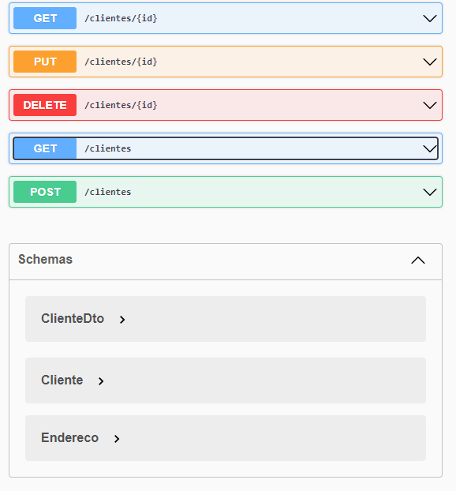

# Projeto API REST com SpringBoot

##  Spring REST API
API com operações CRUD para clientes e detecção automática de endereço pelo webservice [ViaCep](https://viacep.com.br/).
## Tecnologias utilizadas

* OpenFeign (Cliente REST)
* Spring Web
* Springdoc OpenAPI/Swagger (View)
* H2 Database (BD in memory)
* Spring Data JPA (BD connection - Hibernate)

## View do Swagger-ui
